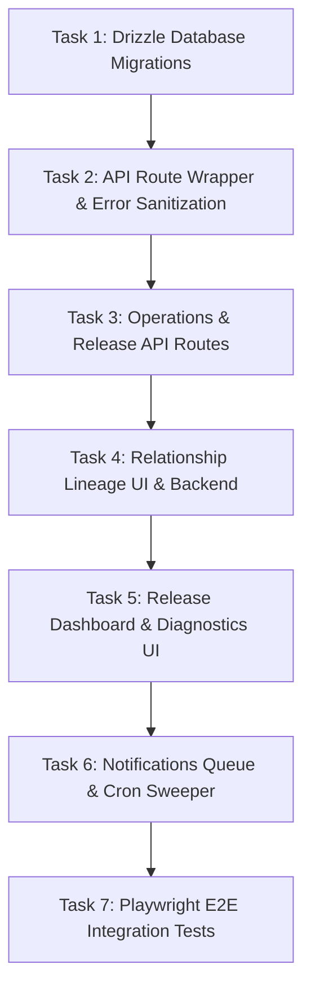

# Phase 2 Operations and Diagnostics — Implementation Plan

This document outlines the step-by-step rollout plan for implementing Phase 2.

---

## 1. Rollout Order & Tasks

### Task 1: Drizzle Database Migrations
- **Modify:** `db/schema.ts` to add the `notificationDeliveries` and `notificationPreferences` table definitions.
- **Generate Migration:** Run `npx drizzle-kit generate` to generate the new SQL migration files.
- **Update DB Verification Test:** Modify `tests/database.test.mjs` to assert that the new tables and indexes exist.
- **Verification:** Run `node --test tests/database.test.mjs`.

### Task 2: Next.js API Route Wrapper & Error Sanitization
- **Create:** `lib/monitoring.ts` utility.
- **Implement:** `withMonitoring(handler)` wrapper function.
  - Automatically wraps Next.js API route handlers.
  - Generates `requestId` for each request (extracts from `x-request-id` header or generates using `crypto.randomUUID()`).
  - Catches unhandled errors, generates a fingerprint, and logs them to `error_events` table.
  - Sanitizes the logged request data, metadata, and error message to strip sensitive keys (`password`, `token`, `cookie`, `key`, `proposedText`, `currentText`).
  - Dispatches to `MONITORING_ALERT_WEBHOOK_URL` if defined and severity is `critical`.

### Task 3: Operations & Release API Routes
- **Create:**
  - `app/api/owner/monitoring/errors/route.ts` (GET list, POST resolve).
  - `app/api/owner/release-readiness/route.ts` (GET applied schema migrations, checks bindings availability, safe R2 reachability check, and latest cron run).
- **Enforce Permissions:** Wrap with `requireOwnerApi` to block non-owner access (returning 403).

### Task 4: Relationship Lineage UI & Backend
- **Create:** `app/api/contracts/[contractId]/relationships/route.ts` returning the relationship lineage.
- **Modify:** `app/workflow/[contractId]/page.tsx` to call this endpoint and render the lineage chain view underneath the contract header.
- **Preserve Locked state:** Ensure that when a predecessor is locked, no "unlock" or "edit" controls are visible in the lineage tree.

### Task 5: Release Dashboard & Diagnostics UI
- **Create:** `app/owner/release-dashboard/page.tsx` owner-only page.
- **Design Layout:**
  - Build Info section (displays active build version & git commit SHA).
  - Worker Bindings grid (D1, R2, Vectorize statuses).
  - Operational Errors table (lists unresolved errors, with details expanded drawer, and a "Resolve" button).

### Task 6: Notifications Queue & Cron Sweeper
- **Create:** `lib/notifications.ts` containing the queue dispatch interface.
- **Modify:** `worker/index.ts` `scheduled()` handler:
  - Sweeps `reminder_schedules` to enqueue pending notifications into `notification_deliveries`.
  - Runs queue worker loop: reads `queued` deliveries, attempts delivery (default stub logs to console), logs attempt counts, handles backoff.
- **UI Copy Audit:** Double check all UI components to guarantee any notification state represents logs as `"queued"` or `"logged"`, never `"sent"`.

### Task 7: Playwright E2E Integration Tests
- **Create:** `tests/e2e/operations.spec.ts`.
- **Verify:**
  - Unauthenticated access returns 401.
  - View-only/reviewer access to dashboard returns 403.
  - Lineage chain renders.
  - Errors are sanitized (removing test password keys from logs).
  - Notification copy remains restricted to `"queued"` / `"logged"`.

---

## 2. Acceptance Criteria

1. **Safety & Security:** No secrets, raw passwords, auth session cookies, text proposals, or contract contents are ever written to `error_events` metadata.
2. **Diagnostic Coverage:** Release readiness page provides absolute verification of the health of R2 bucket connectivity (by head checking `.system_health_check_dummy`), D1 query execution, and Vectorize presence.
3. **Immutability of History:** Predecessor contracts in a lineage chain remain strictly read-only once locked. No database writes are initiated on predecessor contracts when executing successor amendments.
4. **Local Isolation:** Playwright E2E executes cleanly inside `tests/e2e/operations.spec.ts` using `.wrangler/state-e2e` sandbox state, leaving developer workspace databases untouched.

---

## 3. Known Limitations

- **Local Logging Only:** Emails/notifications are only logged to console/DB in this phase. Real SMTP/SMS dispatch is out of scope.
- **SQLite Index Addition:** Adding references/indexes to pre-existing columns does not add database foreign keys directly at SQLite schema level (due to D1/SQLite limitations on table altering), referential checks are enforced in Javascript api code.

---

## 4. Decisions Requiring User Approval

Please review and approve the following operational design choices before implementation begins:

1. **R2 Connectivity Health Probe Strategy:**
   - **Proposed:** The dashboard does a read-only metadata look-up (`head`) on a static system file named `.system_health_check_dummy` to confirm R2 binding is active.
   - **Alternative:** Do a mock `put` and `delete` cycle. (Not recommended because it mutates R2 and could cause clean-up leakage).

2. **Deduplication Threshold for Fingerprinted Errors:**
   - **Proposed:** Group identical errors under a single fingerprint, incrementing `occurrence_count` and updating `last_seen_at`.
   - **Alternative:** Create a new row in `error_events` for every error. (Not recommended as it bloats D1 database quickly).

3. **Notification "Logged" copy styling:**
   - **Proposed:** The dashboard notifications grid will state `"Logged to Local Queue"`.
   - **Alternative:** State `"Queued (Stub)"`.
