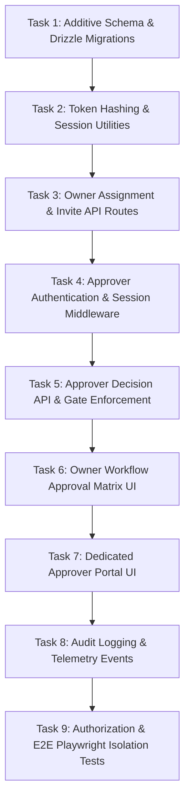

# Phase 3 Delegated Approvals — Implementation Plan

This document outlines the planned rollout sequence for implementing Phase 3 (Delegated, Multi-Person Approvals).

> [!NOTE]
> This is a design/specification document. No application code, database migrations, or test files are implemented as part of this turn.

---

## 1. Rollout Sequence & Task Breakdown

### Task 1: Additive Schema & Drizzle Migrations
- **Schema Additions (`db/schema.ts`)**: Add `delegatedApprovers`, `approvalInvites`, and `approverSessions`. Extend `approvalRequests` with `delegatedApproverId` and `assignedBy`.
- **Migration Generation**: Run `npm run db:generate` to produce forward-only SQL migration `0013_delegated_approvals.sql`.
- **Database Test Suite**: Update `tests/database.test.mjs` to assert the presence of new tables, foreign keys, and indexes.

### Task 2: Token Hashing & Session Utilities
- **Utility Module (`lib/approver-auth.ts`)**:
  - Implement 256-bit cryptographically secure token generation (`crypto.getRandomValues`).
  - Implement token hashing using `sha256Hex`.
  - Implement session creation and validation routines.
  - Implement cookie helper for `__Host-Pactline-Approver-Session` (HttpOnly, `SameSite=Strict`, `Path=/`).

### Task 3: Owner Assignment & Invite API Routes
- **Endpoints**:
  - `POST /api/owner/contracts/[contractId]/approvers`: Assign named delegated approvers.
  - `GET /api/owner/contracts/[contractId]/approvals`: Fetch approval matrix for owner.
  - `POST /api/owner/contracts/[contractId]/approvals/[id]/invite`: Generate fresh invite token/URL.
  - `POST /api/owner/contracts/[contractId]/approvals/[id]/revoke`: Revoke active invite or request.

### Task 4: Approver Authentication & Session Middleware
- **Endpoints**:
  - `GET /api/approver/invite/consume`: Validate token, mark `used_at`, issue session cookie, and redirect.
  - `GET /api/approver/session`: Verify active `__Host-Pactline-Approver-Session` cookie.
  - `POST /api/approver/logout`: Revoke session in DB and clear cookie.

### Task 5: Approver Decision API & Gate Enforcement
- **Endpoints**:
  - `GET /api/approver/contracts/[contractId]`: Fetch read-only version snapshot for assigned approver.
  - `POST /api/approver/contracts/[contractId]/decide`: Submit `approved` or `edits_requested` with mandatory rationale (`decisionReason`).
- **Server Gate**:
  - Update agreement, locking, and execution endpoints (`/api/contracts/[contractId]/agree`, `/api/contracts/[contractId]/lifecycle`) to block when any version-scoped required approval is not `approved` (returns `409 Conflict`).

### Task 6: Owner Workflow Approval Matrix UI
- **UI Modifications (`app/workflow/[contractId]/page.tsx`)**:
  - Add "Delegated Approval Matrix" card displaying legal, finance, security, and business approval statuses.
  - Add "Assign Approver" modal.
  - Add "Copy Invite Link" action (copies local-stub URL `http://localhost:4319/approve/invite?token=...`).
  - Add "Request Re-approval" button for version re-evaluation.

### Task 7: Dedicated Approver Portal UI
- **New Page (`app/approve/[contractId]/page.tsx`)**:
  - Isolated minimal decision interface.
  - Renders contract version snapshot, approval request metadata, and mandatory rationale textarea.
  - Renders decision buttons ("Approve", "Request Edits").
  - Stripped of all owner, reviewer, and supplier navigation or management controls.

### Task 8: Audit Logging & Telemetry Events
- Add structured audit logging in `audit_log_entries` for assignment, invite creation/consumption/revocation, decision recording, and re-approval requests.

### Task 9: Authorization & E2E Playwright Isolation Tests
- **API Security Spec (`tests/e2e/api/edge-cases.spec.ts`)**: Add tests for 401 unauthenticated, 403 cross-role access, 410 expired invite consumption, and 400 missing rationale.
- **E2E Integration Spec (`tests/e2e/operations.spec.ts`)**: Full flow from owner assignment to invite consumption, decision submission, version increment, re-approval, and server gate verification.
