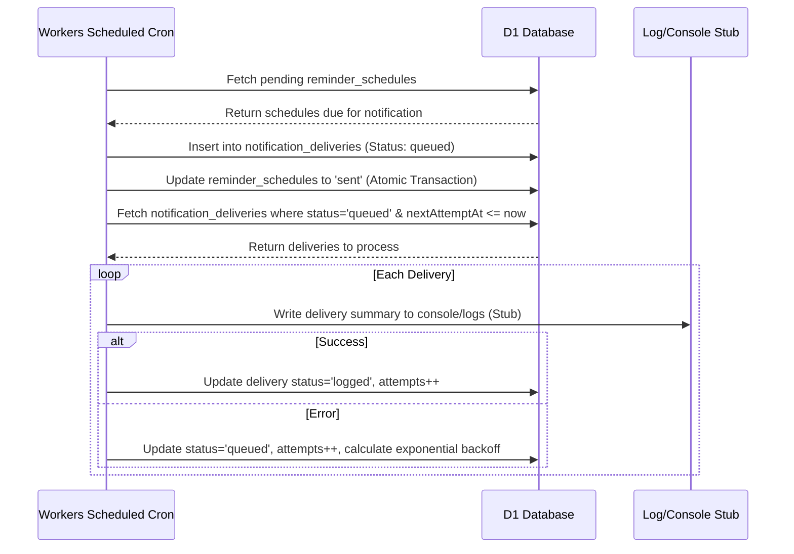

# Phase 2 Operations and Relationships — Design Spec

Date: 2026-08-20
Repo: `pactline-contract-collaboration`
Base branch: `codex/version-two-expansion`
Design branch: `feature/phase-two-operations-design`

## 1. Background and Goals

Phase 2 focuses on hardening operational observability, defining contract relationship lineage, building an administrative health dashboard, and establishing a provider-neutral notification pipeline.

Key requirements:
- **Contract Lineage:** Model contract chains (predecessor/successor) for amendments and renewals with immutable locked sources and no "unlock" path.
- **Observability:** Centralized Next.js route monitoring and error logging via Next.js route wrappers, deduplication, and resolution tracking, without logging sensitive data (PII, tokens, passwords, prompts, or contract text).
- **Release Dashboard:** A read-only owner-accessible dashboard verifying deployment integrity, migration counts, binding readiness, and operational status.
- **Provider-Neutral Notifications:** An asynchronous notification queue with templates, exponential backoff, and user unsubscribe preferences. The default provider is a local console/storage stub, with strict UI copy constraints ("queued" or "logged" rather than "sent").

---

## 2. Proposed Database Schema and Migrations

All Drizzle migrations in Phase 2 are **additive and forward-only**. No destructive changes (e.g. `DROP COLUMN` or `DROP TABLE`) are permitted.

### Schema Additions (`db/schema.ts`)

```typescript
import { sqliteTable, text, integer, index, uniqueIndex } from "drizzle-orm/sqlite-core";

// 1. Notification queue for asynchronous processing
export const notificationDeliveries = sqliteTable("notification_deliveries", {
  id: text("id").primaryKey(),
  recipientEmail: text("recipient_email").notNull(),
  templateName: text("template_name").notNull(),
  // Stored as JSON object containing key-value pairs for rendering templates
  templatePayload: text("template_payload", { mode: "json" })
    .notNull()
    .$type<Record<string, unknown>>(),
  status: text("status", { enum: ["queued", "logged", "failed"] }).notNull().default("queued"),
  attempts: integer("attempts").notNull().default(0),
  nextAttemptAt: text("next_attempt_at"),
  lastError: text("last_error"),
  createdAt: text("created_at").notNull().default(sql`CURRENT_TIMESTAMP`),
  updatedAt: text("updated_at").notNull().default(sql`CURRENT_TIMESTAMP`),
}, (table) => [
  index("idx_notification_deliveries_status_next").on(table.status, table.nextAttemptAt),
]);

// 2. User notification unsubscribe preferences
export const notificationPreferences = sqliteTable("notification_preferences", {
  id: text("id").primaryKey(),
  userId: text("user_id").references(() => users.id, { onDelete: "cascade" }),
  portalAccountId: text("portal_account_id").references(() => portalAccounts.id, { onDelete: "cascade" }),
  notificationType: text("notification_type", { enum: ["renewal", "comment", "approval", "amendment"] }).notNull(),
  unsubscribed: integer("unsubscribed", { mode: "boolean" }).notNull().default(false),
  createdAt: text("created_at").notNull().default(sql`CURRENT_TIMESTAMP`),
  updatedAt: text("updated_at").notNull().default(sql`CURRENT_TIMESTAMP`),
}, (table) => [
  uniqueIndex("idx_notification_pref_user_type").on(table.userId, table.notificationType),
  uniqueIndex("idx_notification_pref_portal_type").on(table.portalAccountId, table.notificationType),
]);
```

### Forward-only Migration Safety
1. **Additive Updates:** SQLite/D1 does not support dropping columns or renaming columns natively without database rebuilds. All changes are purely additive.
2. **Schema Verification Guard:** `tests/database.test.mjs` is extended to assert the presence of `notification_deliveries` and `notification_preferences` columns and indexes.
3. **No Rollback Script:** Recovery plans must consist of rolling forward with corrective schema modifications (patch migrations), preserving user resolution, comments, and audit log history.

---

## 3. Data Model and API / Permission Matrix

### Semantics of Contract Relationships
Using the existing `contract_relationships` table, we define specific system behaviors for each relationship type:
- **`amends`**: Indicates the source contract modifies or adds terms to the target contract. Both contracts remain active in the system. The successor UI chain lists the amendment as sub-governed.
- **`renews`**: Indicates the source contract extends the term of the target contract. Once the source contract transitions to `executed`, the target contract's stage automatically shifts to `renewed` and the original contract remains locked.
- **`supersedes`**: Indicates the source contract completely replaces the target contract. Once the source contract is `executed`, the target contract transitions to `expired` or is marked as superseded.
- **`related`**: Indicates a generic business link between contracts without any stage transition logic.

### API Endpoint Specifications

#### 1. Contract Relationship Chain
* **`GET /api/contracts/[contractId]/relationships`**
  * **Role:** Owner, Reviewer, or Supplier (subject to grant permissions).
  * **Function:** Returns the full ancestor and descendant tree of the contract.
  * **Response:**
    ```json
    {
      "contractId": "sample-contract",
      "ancestors": [
        { "id": "original-msa", "title": "Original MSA", "relationship": "supersedes", "status": "expired" }
      ],
      "descendants": [
        { "id": "amendment-1", "title": "Amendment No. 1", "relationship": "amends", "status": "locked" }
      ]
    }
    ```

#### 2. Monitoring & Error Log Management
* **`GET /api/owner/monitoring/errors`**
  * **Role:** Owner Only (`requireOwnerApi` gated).
  * **Function:** Lists unresolved or recent error events from `error_events` table. Supports pagination and filtering by severity.
* **`POST /api/owner/monitoring/errors/[errorId]/resolve`**
  * **Role:** Owner Only.
  * **Function:** Updates `error_events.resolvedAt` to the current timestamp.

#### 3. Release Readiness Page
* **`GET /api/owner/release-readiness`**
  * **Role:** Owner Only.
  * **Function:** Runs diagnostic read-only checks on Worker bindings and DB schema versioning.

#### 4. Notification Preferences
* **`POST /api/portal/notifications/preferences`** (Portal User) and **`POST /api/owner/notifications/preferences`** (Owner User)
  * **Function:** Update unsubscribe settings.

### API Permission Matrix

| Endpoint | Method | Owner Session | Supplier Session | Reviewer Session |
|---|---|---|---|---|
| `/api/contracts/[id]/relationships` | `GET` | ✅ own org | ✅ if contract granted | ✅ if contract granted |
| `/api/owner/monitoring/errors` | `GET` | ✅ | ❌ 403 | ❌ 403 |
| `/api/owner/monitoring/errors/[id]/resolve` | `POST` | ✅ | ❌ 403 | ❌ 403 |
| `/api/owner/release-readiness` | `GET` | ✅ | ❌ 403 | ❌ 403 |
| `/api/portal/notifications/preferences` | `POST` | ❌ 403 | ✅ own account | ❌ 403 |
| `/api/owner/notifications/preferences` | `POST` | ✅ own user | ❌ 403 | ❌ 403 |

---

## 4. Scheduled-Worker Behavior and Idempotency Strategy

Cloudflare Workers `scheduled()` cron handler is executed every 5 minutes (`cron: "*/5 * * * *"`).



### Idempotency and Race Prevention
1. **Atomic Enqueueing:** The sweep of `reminder_schedules` and creation of `notification_deliveries` run in a single D1 transaction. Schedules are updated from `scheduled` to `sent` instantly during enqueuing.
2. **Locking Queue Rows:** Processing queue rows selects entries with:
   `WHERE status = 'queued' AND (nextAttemptAt IS NULL OR nextAttemptAt <= CURRENT_TIMESTAMP) AND attempts < 5`
   To prevent multiple concurrent scheduled worker executions from processing the same row, the worker immediately updates the status to `processing` or increments `attempts` and sets a future `nextAttemptAt` (e.g. current time + 1 minute) inside a transaction before performing the delivery logic.
3. **Exponential Backoff:** If delivery fails (e.g. logging writes fail), `nextAttemptAt` is set to `now + (2^attempts * 30 seconds)`.

---

## 5. Exact UI Surfaces

### 1. Contract Relationship Lineage View
* **Location:** Inside `app/workflow/[contractId]/page.tsx`, directly below the contract header metadata block.
* **Layout:** A visual card (`.workflow-card .relationship-chain`).
* **Visual Specification:**
  * Displays a linear chain of predecessor and successor contracts.
  * Each node contains: Contract Title (linked), Effective Date, and Status badge.
  * Explicit governing version note is rendered at the top of the chain if the contract has active amendments.
  * Safe locked indicator for executed predecessors with NO unlock buttons.

```
+-----------------------------------------------------------+
| Relationship Chain                                        |
| Predecessor: [Original Services Agreement (V1)] - Executed|
|              (Effective: 2025-01-01)                      |
|                     │                                     |
|                     ▼                                     |
| Current:     [Demo Master Services Agreement (V2)] - Active|
|                     │                                     |
|                     ▼                                     |
| Successor:   [Amendment No. 1 (V1)] - Locked              |
+-----------------------------------------------------------+
```

### 2. Operational Errors Log View
* **Location:** `/owner/release-dashboard` under the "Operational Diagnostics" tab.
* **Layout:** A table displaying: Timestamp, Route, Error Message, Severity badge, Occurrence Count, and "Resolve" button.
* **Visual Specification:**
  * Errors are fingerprinted. Clicking an error row expands a drawer showing metadata (sanitized, excluding secrets) and the stack trace.
  * Clicking "Resolve" removes it from the default active list.

### 3. Release Readiness Dashboard
* **Location:** `/owner/release-dashboard` (accessible to owners only).
* **Visual Components:**
  * **Build Info Card:** Displays compilation commit SHA and build timestamp.
  * **Migrations Card:** Shows applied migrations (e.g., `12 / 12 applied`).
  * **Worker Bindings Health Grid:**
    * `D1 Database`: ✅ Bound & Responsive (shows roundtrip time)
    * `R2 Documents`: ✅ Bound & Reachable (runs a read-only metadata fetch on a dummy text key)
    * `Vectorize Index`: ✅ Bound & Available
  * **Cron Heartbeat Indicator:** Displays timestamp of the latest successful scheduled worker execution.

---

## 6. Security and Sanitization Rules

To preserve privacy and prevent credential leaks, the error log capture wrapper (`withMonitoring`) and the diagnostic endpoints must implement strict sanitization logic:

1. **Parameter Stripping:** Before writing to `error_events` or rendering on screen, any request payload keys containing `password`, `token`, `cookie`, `key`, `body`, `prompt`, `proposedText`, or `currentText` must be replaced with `[REDACTED]`.
2. **Read-only Diagnostics:** The R2 health check performs an existence check (`head`) on a static system health file (e.g. `.system_health_check_dummy`), never listing the entire bucket contents or exposing the raw bucket credentials.
3. **No Prompt Storage:** Under no circumstances should AI assistant prompts or user text proposals be persisted in monitoring tables.

---

## 7. Test Strategy & Local E2E Isolation

### Local E2E Isolation
- **Miniflare Sandbox:** E2E runs use a dedicated D1 sqlite database directory `.wrangler/state-e2e` triggered by the env flag `PACTLINE_E2E: "true"`.
- **Wrangler Bindings:** Playwright tests run against wrangler dev proxying localhost local bindings. Mock settings are populated during `resetDemo()` calls.
- **Single Threaded Run:** Playwright config is pinned to `workers: 1` to prevent database locks on SQLite.

### Operational Specific Test Specifications (`tests/e2e/operations.spec.ts`)
1. **Sanitization Test:** Induces a route error containing a test password in query parameters, fetches the error event as owner, and asserts that the password parameter value is `[REDACTED]`.
2. **Dashboard Authenticated Access:** Confirms non-owners (reviewer/supplier) receive a 403 on `/api/owner/release-readiness` and `/api/owner/monitoring/errors`.
3. **Relationship Lineage Rendering:** Seeds a chain of `supersedes` relationships, navigates to the workflow page, and asserts the predecessor nodes are displayed with proper link anchors.
4. **Queue Logging Copy:** Triggers a notification-worthy action (e.g. comment added), fetches the notification queue view, and asserts the status is displayed as `"queued"` or `"logged"`—never `"sent"`.
